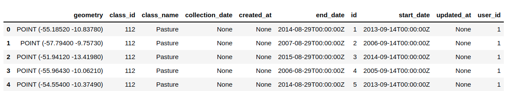

..
    This file is part of Python Client Library for Sample Database Model.
    Copyright (C) 2020-2021 INPE.

    Python Client Library for Sample Database Model is free software; you can redistribute it and/or modify it
    under the terms of the MIT License; see LICENSE file for more details.

Overview of Dataset Data
------------------------

The ``Dataset.data`` property return the data in  `GeoPandas <https://geopandas.readthedocs.io/en/latest/index.html>`_: ``geopandas.GeoDataFrame`` structure. An example of how to access ``Dataset.data`` property is shown below::

    ds = service['lagig-1983_2017-V1']
    data = ds.data
    data.head()

The code below show the dataset data in ``Geodataframe``:

In ``sample.py`` this struct store geometry column, named ``location``. Geometries are in ``EPSG:4326``. We can easily re-project a GeoSeries to another CRS, using ``.to_crs()``.

The other columns are:

- id: The sample id .
- start_date: The start date of the sample.
- end_date: The end date of the sample.
- collection_date: The collection date of the sample.
- class_id: The class id of the sample.
- class_name: The class name of the sample.
- user_id: id of the user who registered the sample.
- user_name: The name of user who registered the sample.